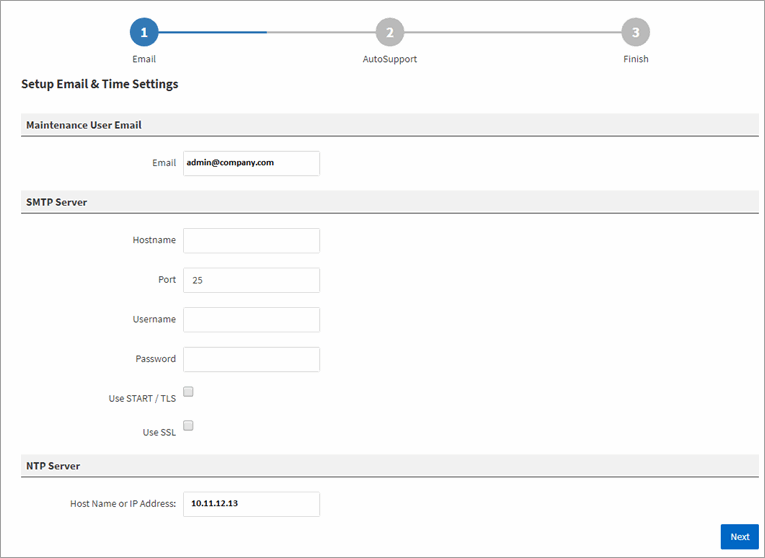

= Unified Manager 웹 UI의 초기 설정 수행
:allow-uri-read: 
:icons: font
:imagesdir: ../media/

[role="lead"]
Unified Manager를 사용하려면 먼저 NTP 서버, 유지보수 사용자 이메일 주소, SMTP 서버 호스트 이름 및 옵션을 포함한 초기 설정 옵션을 구성해야 합니다.

== 시작하기 전에

다음 작업을 수행해야 합니다.

* 설치 후 제공된 URL을 사용하여 Unified Manager 웹 UI를 실행했습니다
* 설치 중에 생성된 유지보수 사용자 이름 및 암호(Linux 설치의 경우 umadmin 사용자)를 사용하여 로그인했습니다

== 이 작업에 대해

OnCommand Unified Manager 초기 설정 페이지는 웹 UI에 처음 액세스할 때만 나타납니다. 아래 페이지는 VMware 설치 페이지입니다.

나중에 이러한 옵션을 변경하려면 * 를 클릭하여 액세스할 수 있는 관리 옵션을 사용할 수 있습니다image:../media/clusterpage-settings-icon.gif[""]를 클릭합니다.

== 단계

. OnCommand Unified Manager 초기 설정 * 창에서 유지보수 사용자 이메일 주소, SMTP 서버 호스트 이름 및 추가 SMTP 옵션, NTP 서버(VMware 설치만 해당)를 입력합니다. 그런 다음 * 다음 * 을 클릭합니다.
. AutoSupport * 페이지에서 * 동의 및 계속 * 을 클릭하여 AutoSupport를 활성화합니다.
+
지원을 위해 AutoSupport 콘텐츠를 전송하기 위해 인터넷 액세스를 제공할 프록시를 지정해야 하거나 AutoSupport를 사용하지 않도록 설정하려면 관리 옵션을 사용합니다.

. Red Hat 및 CentOS 시스템에서 umadmin 사용자 암호를 기본 ""admin" 문자열에서 사용자 정의 문자열로 변경하도록 선택할 수 있습니다.

== 결과

초기 설정 창이 닫히고 Unified Manager 웹 UI가 표시됩니다. 시스템에 클러스터를 추가할 수 있도록 구성/클러스터 데이터 소스 페이지가 나타납니다.
