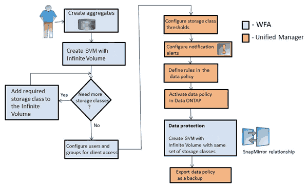

= 스토리지 클래스 및 데이터 정책으로 무한 확장 볼륨 관리
:allow-uri-read: 
:icons: font
:imagesdir: ../media/

[role="lead"]
필요한 수의 스토리지 클래스를 사용하여 무한 확장 볼륨을 생성하고, 각 스토리지 클래스에 대한 임계값을 구성하고, 규칙과 데이터 정책을 생성하여 무한 확장 볼륨에 쓴 데이터 배치를 결정하고, 데이터 보호를 구성하고, 선택적으로 알림 경고를 구성하여 무한 확장 볼륨을 효과적으로 관리할 수 있습니다.

== 시작하기 전에

* WFA(OnCommand Workflow Automation)가 설치되어 있어야 합니다.
* OnCommand 관리자 또는 스토리지 관리자 역할이 있어야 합니다.
* WFA에서 사전 정의된 적절한 워크플로우를 커스터마이징하여 필요한 개수의 애그리게이트를 만들어야 합니다.
* WFA에서 사전 정의된 적절한 워크플로우를 사용자 지정하여 필요한 스토리지 클래스 수를 생성해야 합니다.
* WFA에서 Unified Manager 서버를 데이터 소스로 구성해야 하며, 이때 데이터가 성공적으로 캐시되었는지 확인해야 합니다.

== 이 작업에 대해

이 작업을 수행하는 동안 WFA(OnCommand Workflow Automation)와 OnCommand Unified Manager의 두 애플리케이션 간에 전환해야 합니다.

이 작업은 높은 수준의 단계를 제공합니다. WFA 작업 수행에 대한 자세한 내용은 _OnCommand Workflow Automation_설명서를 참조하십시오.

== 단계

. image:../media/wfa-icon.gif["WFA 절차 아이콘입니다"] 사전 정의된 워크플로우를 사용자 지정하여 필요한 스토리지 클래스를 정의합니다.
. image:../media/wfa-icon.gif["WFA 절차 아이콘입니다"] 적절한 워크플로우를 사용하여 필요한 스토리지 클래스 수로 무한 확장 볼륨을 SVM과 함께 생성합니다.
. image:../media/um-icon.gif["Unified Manager 절차를 위한 아이콘입니다"] 무한 확장 볼륨이 있는 SVM이 포함된 클러스터를 Unified Manager 데이터베이스에 추가합니다.
+
클러스터의 IP 주소 또는 FQDN을 제공하여 클러스터를 추가할 수 있습니다.

. image:../media/um-icon.gif["Unified Manager 절차를 위한 아이콘입니다"] xref:task-editing-storage-class-threshold-settings.adoc[조직의 요구 사항에 따라 각 스토리지 클래스에 대한 임계값을 수정합니다].
+
스토리지 클래스 공간을 효과적으로 모니터링하려면 기본 스토리지 클래스 임계값 설정을 사용해야 합니다.

. image:../media/um-icon.gif["Unified Manager 절차를 위한 아이콘입니다"] xref:task-adding-alerts.adoc[무한 확장 볼륨과 관련된 가용성 및 용량 문제를 해결할 수 있도록 알림 경고 및 트랩을 구성합니다].
. image:../media/um-icon.gif["Unified Manager 절차를 위한 아이콘입니다"] xref:task-creating-rules.adoc[데이터 정책에서 규칙을 설정한 다음 데이터 정책에 대한 모든 변경 내용을 활성화합니다]
+
데이터 정책의 규칙에 따라 무한 확장 볼륨에 쓴 콘텐츠의 위치가 결정됩니다.

+
[NOTE]
====
데이터 정책의 규칙은 무한 확장 볼륨에 쓴 새 데이터에만 영향을 미치고 무한 확장 볼륨의 기존 데이터에는 영향을 주지 않습니다.

====
. image:../media/wfa-icon.gif["WFA 절차 아이콘입니다"] 무한 확장 볼륨을 사용하여 DR(재해 복구) SVM을 생성한 후 다음 단계를 수행하여 데이터 보호(DP)를 구성합니다.
+
.. 적절한 워크플로우를 사용하여 데이터 보호(DP) 무한 확장 볼륨 생성
.. 적절한 워크플로우를 사용하여 소스와 대상 간의 DP 미러 관계를 설정합니다.

