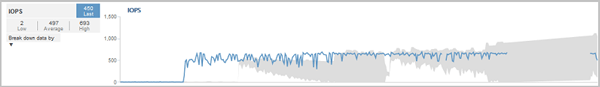

= 클러스터 작업이 워크로드 지연 시간에 미치는 영향
:allow-uri-read: 
:icons: font
:imagesdir: ../media/

[role="lead"]
운영(IOPS)은 클러스터에서 모든 사용자 정의 및 시스템 정의 워크로드의 작업을 나타냅니다. IOPS 통계는 백업 또는 중복제거 실행 등과 같은 클러스터 프로세스가 워크로드 지연 시간(응답 시간)에 영향을 미치는지, 또는 성능 이벤트의 원인인지 여부를 파악하는 데 도움이 됩니다.

성능 이벤트를 분석할 때 IOPS 통계를 사용하여 성능 이벤트가 클러스터 문제로 인해 발생했는지 여부를 확인할 수 있습니다. 성과 이벤트의 주요 기여 요인이 되었을 수 있는 특정 워크로드 활동을 식별할 수 있습니다. IOPS는 초당 작업 수(ops/초)로 측정됩니다.

이 예에서는 성능/볼륨 세부 정보 페이지의 IOPS 차트를 보여 줍니다. 실제 작업 통계는 파란색 선으로, 예상 작업 통계 범위는 회색입니다.

[NOTE]
====
클러스터가 과부하된 경우 Unified Manager에서 메시지를 표시할 수 있습니다 `Data collection is taking too long on Cluster cluster_name`. 즉, Unified Manager에서 분석할 수 있는 통계가 충분히 수집되지 않았습니다. 통계를 수집할 수 있도록 클러스터에서 사용하는 리소스를 줄여야 합니다.

====