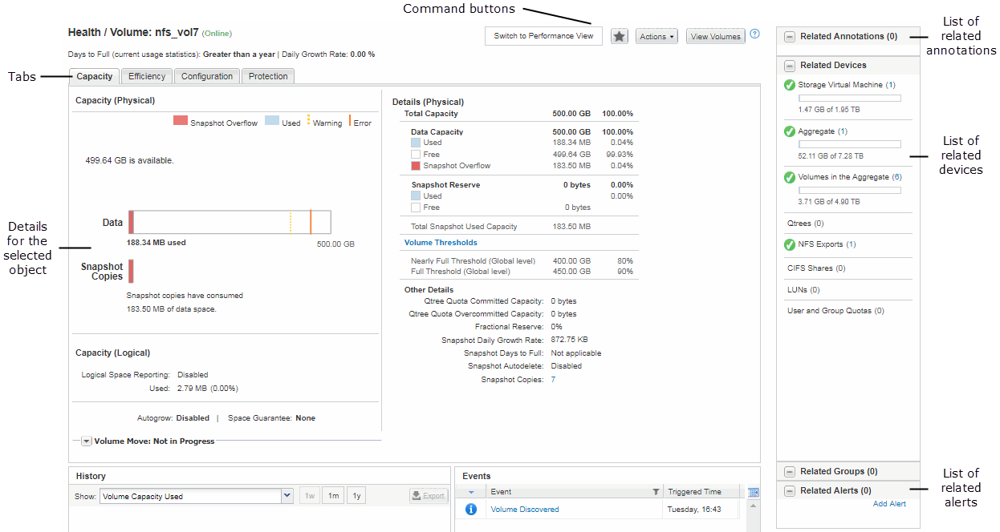

= 일반적인 창 레이아웃
:allow-uri-read: 
:icons: font
:imagesdir: ../media/

[role="lead"]
일반적인 창 레이아웃을 이해하면 OnCommand Unified Manager를 효율적으로 탐색하고 사용할 수 있습니다. 대부분의 Unified Manager 창은 두 가지 일반적인 레이아웃 중 하나, 즉 개체 목록 또는 세부 사항과 비슷합니다. 권장 디스플레이 설정은 최소 1280 x 1024 픽셀입니다.

모든 창에 다음 다이어그램의 모든 요소가 포함되는 것은 아닙니다.

== 개체 목록 창 레이아웃

image::../media/object-list.gif[개체 목록]

== 개체 세부 정보 창 레이아웃

