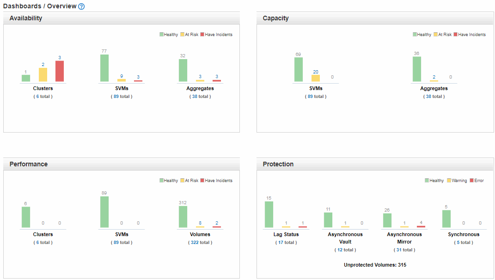

= 상태 개요 대시보드 이해
:allow-uri-read: 
:icons: font
:imagesdir: ../media/

[role="lead"]
Unified Manager 상태 개요 대시보드에서는 스토리지 및 가상화 환경의 상태에 대한 요약 정보를 제공합니다. 대시보드/개요 페이지는 스토리지 오브젝트의 가용성, 용량, 성능 및 보호와 같은 네 가지 상태 범주로 구분된 스토리지 객체에 대한 상태 정보를 제공합니다.

다음 이미지는 대시보드/개요 페이지에 표시되는 창을 보여 줍니다.

== 상태 개요 영역

그래프로 클러스터, 애그리게이트, SVM(스토리지 가상 머신) 등의 스토리지 오브젝트의 상태와 보호 관계 상태를 표시합니다. 대시보드/개요 페이지에는 다음 범주에 대해 생성된 이벤트가 표시됩니다.

노란색 또는 빨간색 막대 차트 위의 숫자를 클릭하면 해당 이벤트만 포함된 이벤트 인벤토리 페이지가 표시됩니다. 차트 아래의 숫자를 클릭하면 해당 개체만 포함된 개체 인벤토리 페이지가 표시됩니다.

* * 가용성 *
+
Unified Manager에서 모니터링하는 클러스터, SVM 및 애그리게이트의 가용성에 대한 정보를 표시합니다. 생성되는 가용성 관련 이벤트에 따라 스토리지 객체가 상태, 위험 또는 인시던트로 분류됩니다.

* * 용량 *
+
Unified Manager에서 모니터링하는 SVM 및 애그리게이트의 용량에 대한 정보를 표시합니다. 생성되는 용량 관련 이벤트에 따라 스토리지 객체가 상태, 위험 또는 인시던트로 분류됩니다.

* * 성능 *
+
Unified Manager에서 모니터링하는 클러스터, SVM 및 볼륨의 성능에 대한 정보를 표시합니다. 생성되는 성능 관련 인시던트에 따라 스토리지 객체가 상태, 위험 또는 인시던트로 분류됩니다.

* * 보호 *
+
Unified Manager에서 모니터링하는 보호 관계에 대한 정보를 표시합니다. 생성되는 보호 관련 이벤트에 따라 보호 관계는 양호, 경고 또는 오류로 분류됩니다.

