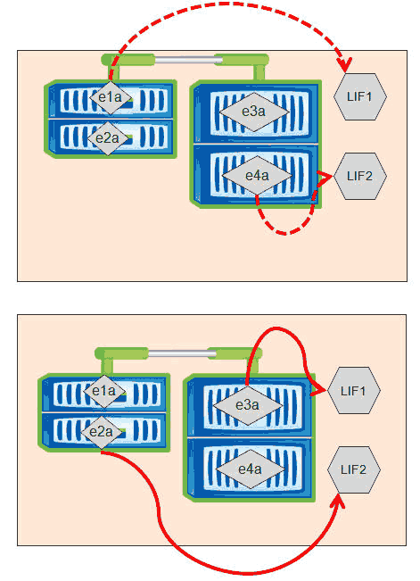

= OnCommand System Manager를 사용하여 LIF의 홈 포트 및 노드를 변경합니다
:allow-uri-read: 
:icons: font
:imagesdir: ../media/

[role="lead"]
홈 포트와 홈 노드를 수정하여 LIF의 기본 위치를 변경할 수 있습니다. LIF를 마이그레이션하는 것보다 구성이 더 오래 지속되며, 일반적으로 예약된 유지보수 중에 LIF를 다른 노드로 일시적으로 재배치하는 데 사용됩니다.

== 이 작업에 대해

다음 이미지는 변경 후 원래 LIF 홈 포트 및 노드와 홈 포트 및 노드를 보여줍니다. 원래 LIF1 홈 포트는 E1A에서 e3a로 변경되었고 LIF2는 e4a에서 e2a로 변경되었습니다.

== 단계

. OnCommand 시스템 관리자를 엽니다.
. Home * 탭에서 스토리지 시스템을 두 번 클릭합니다.
. 탐색 창에서 * SVM * 계층을 확장합니다.
. 탐색 창에서 SVM을 선택하고 * 구성 * > * 네트워크 인터페이스 * 를 클릭합니다.
. LIF를 선택하고 * 편집 * 을 클릭합니다.
. ** 인터페이스 편집** 대화 상자에서 대상 포트의 홈 포트 및 네트워크 주소를 입력합니다.
+
image::../media/systemmgr-lif-edit-jpg.gif[인터페이스 편집 대화 상자]

+
[NOTE]
====
ONTAP 8.2.1에서는 홈 포트 필드가 비활성화됩니다.

====
. 저장 후 닫기 * 를 클릭합니다.

