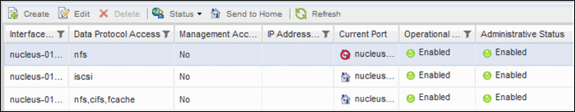

= OnCommand 시스템 관리자를 사용하여 LIF를 홈 포트로 되돌립니다
:allow-uri-read: 
:icons: font
:imagesdir: ../media/

[role="lead"]
LIF가 페일오버되거나 수동으로 또는 자동으로 다른 포트로 마이그레이션된 후 현재 포트에서 홈 포트로 되돌아갈 수 있습니다. OnCommand 시스템 관리자를 사용하여 이 작업을 수행할 수 있습니다.

== 이 작업에 대해

LIF를 생성할 때 관리자는 홈 포트와 홈 노드를 지정하여 LIF의 기본 위치로 사용합니다. 홈 노드를 사용할 수 없거나 홈 포트에서 물리적 링크 중단이 발생하면 LIF가 새 위치로 자동으로 마이그레이션됩니다. 예를 들어, OnCommand 시스템 관리자에서 새 위치가 LIF의 현재 포트로 보고됩니다. 자동 되돌리기 옵션을 사용하지 않으면 LIF는 되돌릴 때까지 이 새 위치에 유지됩니다.

== 단계

. OnCommand 시스템 관리자를 엽니다.
. Home * 탭에서 스토리지 시스템을 두 번 클릭합니다.
. 탐색 창에서 * 스토리지 가상 머신 * 계층 구조를 확장합니다.
. 탐색 창에서 SVM을 선택하고 * 구성 * > * 네트워크 인터페이스 * 를 클릭합니다.
. 다음 이미지와 같이 * Current Port * 열에서 빨간색 십자 표시가 있는 집 아이콘을 표시하는 데이터 LIF를 찾습니다.
+

. LIF를 선택하고 * 홈으로 전송 * 을 클릭합니다.
+
이 옵션은 선택한 인터페이스가 홈 포트가 아닌 포트에서 호스팅되고 홈 포트를 사용할 수 있는 경우에만 활성화됩니다.

