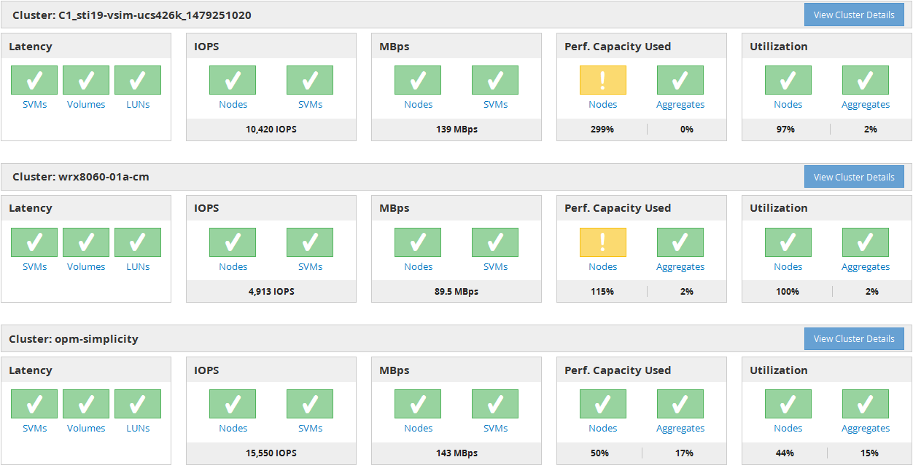

= 성능 대시보드 이해
:allow-uri-read: 
:icons: font
:imagesdir: ../media/

[role="lead"]
Unified Manager Performance 대시보드에서는 사용자 환경에서 모니터링 중인 모든 클러스터의 성능 상태를 개괄적으로 보여 줍니다. 성능 문제가 있는 클러스터는 페이지 맨 위에서 심각도별로 정렬됩니다. 대시보드의 정보는 5분 동안의 성능 수집 기간 동안 자동으로 업데이트됩니다.

다음 그림은 두 클러스터를 모니터링하고 있는 Unified Manager Performance 대시보드의 예입니다.

스토리지 객체를 나타내는 상태 아이콘은 최상위 심각도부터 가장 낮은 심각도까지 정렬된 다음 상태일 수 있습니다.

* 심각(image:../media/sev-critical-um60.png["이벤트 심각도에 대한 아이콘 – 심각"]): 객체에 대해 하나 이상의 새로운 중요 성능 이벤트가 보고되었습니다.
* 경고(image:../media/sev-warning-um60.png["이벤트 심각도에 대한 아이콘 - 경고"]): 객체에 대해 하나 이상의 새 경고 성능 이벤트가 보고되었습니다.
* 정상(image:../media/sev-normal-um60.png["이벤트 심각도에 대한 아이콘 - 정상"]): 객체에 대해 새로운 성능 이벤트가 보고되지 않았습니다.

[NOTE]
====
색은 개체에 대한 새 이벤트가 있는지 여부를 나타냅니다. 더 이상 활성 상태가 아닌, 즉 사용되지 않는 이벤트라고 하는 이벤트는 아이콘의 색에 영향을 주지 않습니다.

====

== 클러스터 성능 카운터

각 클러스터에 대해 다음 성능 범주가 표시됩니다.

* 지연 시간
+
에서는 클러스터가 클라이언트 애플리케이션 요청에 얼마나 빠르게 응답하는지 작업 당 밀리초 단위로 보여 줍니다.

* IOPS
+
에는 클러스터의 작동 속도(초당 입출력 작업 수)가 나와 있습니다.

* Mbps
+
는 클러스터에서 또는 클러스터에서 전송되는 데이터의 양을 초당 메가바이트 단위로 보여 줍니다.

* 사용된 성능 용량
+
에는 노드나 애그리게이트에서 사용 가능한 성능 용량을 과도하게 사용하고 있는지 여부가 나와 있습니다.

* 활용률
+
노드나 애그리게이트의 리소스가 초과 사용되고 있는지 여부를 표시합니다.

클러스터 및 스토리지 오브젝트의 성능을 분석하기 위해 다음 작업 중 하나를 수행합니다.

* 클러스터 세부 정보 보기 * 를 클릭하여 클러스터 랜딩 페이지를 표시할 수 있습니다. 이 페이지에서는 선택한 클러스터 및 스토리지 개체에 대한 자세한 성능 및 이벤트 정보를 볼 수 있습니다.
* 객체의 빨간색 또는 노란색 상태 아이콘 중 하나를 클릭하여 해당 객체의 인벤토리 페이지를 표시할 수 있습니다. 여기서 스토리지 객체에 대한 세부 정보를 볼 수 있습니다.
+
예를 들어, 볼륨 아이콘을 클릭하면 성능/볼륨 인벤토리 페이지에 선택한 클러스터의 모든 볼륨 목록이 최악의 성능에서 최상의 성능까지 순서로 정렬됩니다.

